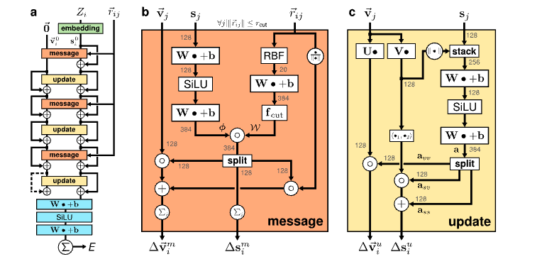

# Just some running notes on implementation and the technicalities
## The Message Update Blocks
So far the current code has two main blocks from the [PaiNN paper](https://arxiv.org/pdf/2102.03150). The message block (b) and the update block (c). The schematic from the paper is seen below.

This is in the blocks module. Using Flax and Jax. Pretty self explanatory. The distances ($r_{ij}$) undergo the contious filter conv layer from the [SchNet Paper](https://arxiv.org/abs/1706.08566) to get the filters. There is an implementation of the CFConv layer in the blocks module but the Message block also has it integrated (for brevity).

### Filters in CFConv

The point of the filters from this act as a (continuous) function that takes the distance between two atoms and outputs a scalar or vector quantity. In this code, the filter is constructed as a form of a Gaussian Radial Basis Function. Currently it is integrated into the blocks module and that leads us onto the first point of improvement:

1. **Add a radial module with cutoffs**    

The purpose of the fitler determins how much an influence an atom has on another based on their distance.

### The rest of the message block
The rest is simple linear and activation layers as well as matrix operations. The product is the delta v and delta s which are the messages passed to the update block.

## Some of the key missing points

Before getting to missing parts, there are intialisation parts we must consider. Computing the edges and the distances (edge_index and r_ij). They can be added to a separate module like utils?

2. **Compute Edges**
3. **Compute distances**

Additionally we need an embedding scheme, perhaps nuclear and electronic (as seen in the top of block a in the first figure). There shall be a separate markdown for that.

4. **Read on Embedding (markdown)**
5. **Implement Embedding**

The original paper has a gated equivariance block. Perhaps one of the more urgen features needing implementation. That leads to two parts: 

6. **Read on Gated Equivariance (update below)**
7. **Implement it in the blocks module**

Additionally, it is my understanding that this new block cannot be implemented without a Readout block. This can apply pooling to aggregate the node features. It implements a way to make the output of the model easier.

8. **Implement Read out block using Gated Equivariance Block**

Additionally, a refactoring of the modules (i.e. remove PaiNN from the blocks module into its own) and add an initialisation for all.

9. **Refactor for reusability**

### Gated Equivariance Block (EDIT)

## Lower Priority Missing Points

The model once complete should be benchmarked (probably by QM9 dataset). As wella s the speed of calculations:

10. **Benchmark on QM9, profile and see timings, once complete add JIT etc**

Once benchmarked there can be a few points of new research. First generate a complete PES, this shall be a separate markdown file. Both 2D and 3D etc. Once complete see if multiple states can be employed to form a Non Adiabtic Dyamics (NAD) model.  

11. **PES and NAD**

